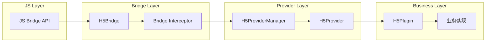
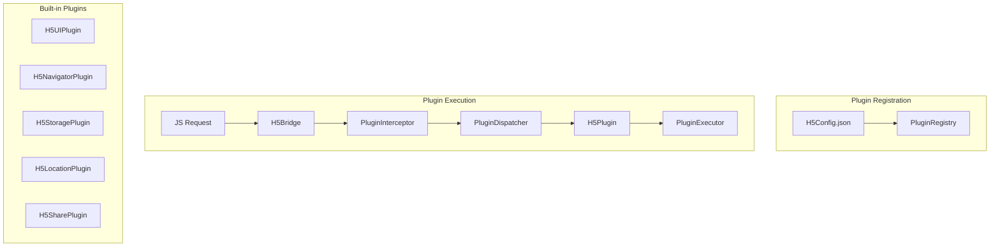

# Coral Android 项目综合分析报告

## 📊 项目 基本信息

概览

###| 项目 | Coral H5 容器 |
|------|---------------|
| **代码量** | 995 个文件 (140,247 行 Java + 149 行 Kotlin) |
| **主语言** | Java (99.9%) |
| **模块数** | 9 个业务模块 |
| **目标 SDK** | Android 35 (minSdk 24) |
| **构建工具** | Gradle 8.8.0 + AGP 8.8.0 |
| **Kotlin 版本** | 2.0.0 |

---

## 🏗️ 模块结构分析

### 模块分布统计

```
┌─────────────────────────────┬───────────┬─────────────────┐
│ 模块                        │ Java文件  │ 主要职责        │
├─────────────────────────────┼───────────┼─────────────────┤
│ base-flame-nebula          │ 629       │ H5容器核心      │
│ adapter-flame               │ 144       │ H5适配层        │
│ base----flame-basis         │ 56        │ 基础网络/数据库  │
│ app                         │ 40        │ 主应用          │
│ base---utils                │ 39        │ 工具类          │
│ base--flame-offlineres      │ 32        │ 离线资源        │
│ base----log                 │ 17        │ 日志系统        │
│ base---flame-core           │ 16        │ 核心配置        │
│ base-data-cache             │ 11        │ 数据缓存        │
└─────────────────────────────┴───────────┴─────────────────┘
```

### 包名结构

```
com.stht.coral                           # 主应用
com.ynet.finmall.adapter                 # H5适配层
  ├── adapter/h5/view                    # 视图
  ├── adapter/h5/plugin                  # 插件
  ├── adapter/h5/provider                # Provider
  ├── adapter/h5/manager                 # 管理器
  ├── adapter/h5/utils                   # 工具
  └── adapter/h5/appConfig               # 配置

com.ynetpay.mobile                       # H5容器核心
  ├── h5container/api                    # API
  ├── h5container/service                # 服务
  ├── nebula                             # 核心模块
  │   ├── activity                       # 页面
  │   ├── manager                        # 管理器
  │   ├── bridge                         # 桥接
  │   ├── provider                       # Provider
  │   ├── util                          # 工具
  │   ├── view                          # 自定义视图
  │   ├── config                        # 配置
  │   ├── callback                      # 回调
  │   ├── network                       # 网络
  │   ├── permission                    # 权限
  │   └── resource                      # 资源
  ├── nebulacore                         # 核心实现
  │   ├── manager                       # 管理器
  │   ├── bridge                        # 桥接
  │   ├── plugin                        # 插件
  │   ├── view                         # 视图
  │   ├── ui                           # 页面
  │   └── biz                          # 业务
  └── quinox                            # 基础设施
      ├── app                           # 应用
      ├── application                  # 应用类
      ├── service                      # 服务
      └── utils                        # 工具

com.ynet.flame                           # 基础模块
  ├── basis                             # 基础库
  │   ├── network                       # 网络
  │   ├── DBmanager                     # 数据库
  │   └── utils                        # 工具
  ├── core                              # 核心
  │   ├── configServer                  # 配置服务
  │   └── networkex                     # 网络扩展
  └── ...

com.ynet.finmall.base                    # 业务基础
  ├── baseutils                         # 工具类
  └── log                               # 日志
```

---

## 🎯 架构模式分析

### 整体架构

```
┌─────────────────────────────────────────────────────────────────┐
│                         应用层 (app)                            │
│  ┌─────────────────────────────────────────────────────────┐   │
│  │                   MainActivity                           │   │
│  │              (ViewBinding + 业务调用)                     │   │
│  └─────────────────────────────────────────────────────────┘   │
└─────────────────────────────────────────────────────────────────┘
                              ↓
┌─────────────────────────────────────────────────────────────────┐
│                      适配层 (adapter-flame)                      │
│  ┌─────────────────────────────────────────────────────────┐   │
│  │  H5ActivityManager   │   H5Plugin   │   H5Provider      │   │
│  │  (Activity生命周期)      (插件化)         (组件注入)       │   │
│  └─────────────────────────────────────────────────────────┘   │
└─────────────────────────────────────────────────────────────────┘
                              ↓
┌─────────────────────────────────────────────────────────────────┐
│                     容器层 (base-flame-nebula)                   │
│  ┌─────────────────────────────────────────────────────────┐   │
│  │  H5Activity    │   H5Bridge    │   H5WebView           │   │
│  │  (页面管理)        (JS桥接)          (WebView封装)         │   │
│  │  H5Provider    │   H5Plugin    │   H5Manager           │   │
│  │  (组件)           (插件)            (核心管理)             │   │
│  └─────────────────────────────────────────────────────────┘   │
└─────────────────────────────────────────────────────────────────┘
                              ↓
┌─────────────────────────────────────────────────────────────────┐
│                     核心层 (base---flame-core)                    │
│  ┌─────────────────────────────────────────────────────────┐   │
│  │  ConfigServer   │   NetworkEx   │   Utils              │   │
│  │  (配置服务)        (网络扩展)          (基础工具)           │   │
│  └─────────────────────────────────────────────────────────┘   │
└─────────────────────────────────────────────────────────────────┘
                              ↓
┌─────────────────────────────────────────────────────────────────┐
│                     基础层 (base----flame-basis)                  │
│  ┌─────────────────────────────────────────────────────────┐   │
│  │  OkHttp3       │   SQLCipher   │   FastJSON             │   │
│  │  (网络)          (数据库)          (JSON)                 │   │
│  └─────────────────────────────────────────────────────────┘   │
└─────────────────────────────────────────────────────────────────┘
```

### 架构模式识别

| 层面 | 模式 | 说明 |
|------|------|------|
| **整体** | **Bundle/Plugin** | 模块化 Bundle 架构 |
| **容器** | **Provider pattern** | 通过 ProviderManager 注入组件 |
| **WebView** | **Bridge pattern** | JS-Java 桥接模式 |
| **Activity** | **Template Method** | H5BaseActivity 定义模板 |
| **网络** | **Chain of Responsibility** | 拦截器链 |
| **事件** | **EventBus** | AndroidEventBus 事件总线 |

### 设计模式使用

```
✅ Manager Pattern      - H5ActivityManager, H5BridgeManager
✅ Provider Pattern      - H5Provider, ProviderManager
✅ Bridge Pattern        - H5Bridge (JS桥接)
✅ Observer Pattern      - EventBus, Callback
✅ Singleton Pattern     - LauncherApplicationAgent
✅ Factory Pattern       - H5PluginFactory
✅ Builder Pattern       - OkHttp Request.Builder
✅ Strategy Pattern      - H5Config, H5Strategy
✅ Template Method       - H5BaseActivity
```

---

## 🌉 H5 容器核心机制

### JS-Java Bridge 架构



### 核心组件

| 组件 | 类路径 | 职责 |
|------|--------|------|
| **H5Activity** | `nebulacore.ui.H5Activity` | H5 容器页面 |
| **H5WebView** | `nebulacore.web.H5WebView` | WebView 封装 |
| **H5Bridge** | `nebulacore.bridge.H5Bridge` | JS桥接核心 |
| **H5ProviderManager** | `nebulacore.manager.H5ProviderManager` | Provider 管理 |
| **H5PluginManager** | `nebulacore.manager.H5PluginManager` | 插件管理 |
| **H5Session** | `h5container.api.H5Session` | Session 管理 |
| **H5Service** | `h5container.service.H5Service` | 容器服务 |

### 页面生命周期

```
┌─────────────┐
│ onCreate()  │ ← H5BaseActivity.onCreate()
└──────┬──────┘
       ↓
┌─────────────┐
│ onStart()   │
└──────┬──────┘
       ↓
┌─────────────┐
│ onResume()  │ ← H5Activity.onResume() → JS: onShow
└──────┬──────┘
       ↓
┌─────────────┐
│ onPause()   │ ← H5Activity.onPause() → JS: onHide
└──────┬──────┘
       ↓
┌─────────────┐
│ onStop()    │
└──────┬──────┘
       ↓
┌─────────────┐
│ onDestroy() │
└─────────────┘
```

---

## 📡 API 接口分析

### 暴露给 Native 的 API

```java
// H5Service 接口
public interface H5Service {
    H5Session getTopSession();
    List<H5Session> getSessions();
    void startApp(String appId);
    void startApp(String appId, Map<String, Object> params);
    void closeSession(String sessionId);
}

// H5Session 接口
public interface H5Session {
    String getId();
    String getUrl();
    List<H5Page> getPages();
    void navigateTo(String url);
    void goBack();
    void reload();
}
```

### JS 暴露的方法

```javascript
// JS 调用 Native
HybridAPI.callNative(methodName, params, callback);

// Native 调用 JS
H5Bridge.callJS(bridgeId, methodName, params);

// 常用方法
HybridAPI.setTitle(params)
HybridAPI.setNavigationBarStyle(params)
HybridAPI.share(params)
HybridAPI.getLocation(params)
HybridAPI.scanQRCode(params)
HybridAPI.navigateToMiniProgram(params)
```

### 插件机制



---

## 🔌 第三方 SDK 集成

### 社交分享

| SDK | 用途 | 集成方式 |
|-----|------|----------|
| **微信 SDK** | 微信登录/分享 | `com.tencent.mm.opensdk:wechat-sdk-android-with-mta:5.4.0` |
| **友盟 SDK** | 统计分析 | `com.umeng.umsdk:common:9.4.2` |
| **QQ SDK** | QQ登录/分享 | `com.tencent.tauth:qqopensdk:3.53.0` |

**集成方式：**
```java
// 微信分享示例
IWXAPI api = WXAPIFactory.createWXAPI(context, APP_ID);
api.registerApp(APP_ID);
SendMessageToWX.Req req = new SendMessageToWX.Req();
req.transaction = buildTransaction("webpage");
req.message = message;
api.sendReq(req);
```

### 网络

| 库 | 用途 | 版本 |
|---|------|------|
| **OkHttp3** | HTTP 客户端 | 4.9.2 |
| **FastJSON** | JSON 解析 | 1.2.73 |

### 图片

| 库 | 用途 | 版本 |
|---|------|------|
| **Glide** | 图片加载 | 5.0.5 |
| **AndroidSVG** | SVG 解析 | 1.2.1 |

### 数据库

| 库 | 用途 | 版本 |
|---|------|------|
| **SQLCipher** | 数据库加密 | 3.5.6 |
| **GreenDAO** | ORM | 3.0.0 |

### 工具库

| 库 | 用途 | 版本 |
|---|------|------|
| **Hutool** | 工具类 | 5.8.17 |
| **Apache Commons** | 工具类 | 3.7 |
| **EventBus** | 事件总线 | 1.0.5.1 |
| **RxJava3** | 异步 | 3.0.12 |

---

## 🗂️ 代码结构最佳实践

### 项目组织

```
✅ 良好的实践
├── 按功能分包 (feature-based)
├── 明确的依赖方向 (上层依赖下层)
├── Manager 模式管理全局状态
├── Provider 模式实现依赖注入
├── 插件化架构便于扩展

⚠️ 需改进的地方
├── Java 代码偏多，Kotlin 渗透率低
├── 部分模块职责不够单一
├── 缺少统一的架构约束 (如 MVP/MVVM)
├── 测试覆盖不足
└── 文档缺失
```

---

## 📈 复杂度评估

### 代码复杂度 (按模块)

| 模块 | 文件数 | 复杂度评级 |
|------|--------|-----------|
| base-flame-nebula | 629 | 🔴 高 (核心模块) |
| adapter-flame | 144 | 🟡 中 |
| base----flame-basis | 56 | 🟡 中 |
| base---utils | 39 | 🟢 低 |
| app | 40 | 🟢 低 |
| base--flame-offlineres | 32 | 🟢 低 |
| base----log | 17 | 🟢 低 |
| base---flame-core | 16 | 🟢 低 |
| base-data-cache | 11 | 🟢 低 |

### 技术债识别

| 问题 | 影响 | 建议 |
|------|------|------|
| Java 为主 | 维护成本高 | 逐步迁移 Kotlin |
| 缺少测试 | 质量风险 | 添加单元测试 |
| 事件总线 | 追踪困难 | 考虑 LiveData/RxBus |
| 全局 Manager | 耦合度高 | 考虑依赖注入 |
| 文档缺失 | 交接困难 | 添加 KDoc |

---

## 🔍 关键文件索引

### 核心类

| 文件 | 路径 | 重要性 |
|------|------|--------|
| H5Activity.java | `nebulacore/ui/H5Activity.java` | ⭐⭐⭐ |
| H5Bridge.java | `nebulacore/bridge/H5Bridge.java` | ⭐⭐⭐ |
| H5ProviderManagerImpl.java | `nebulacore/manager/H5ProviderManagerImpl.java` | ⭐⭐⭐ |
| H5PluginManagerImpl.java | `nebulacore/manager/H5PluginManagerImpl.java` | ⭐⭐⭐ |
| H5ActivityManager.java | `adapter/h5/manager/H5ActivityManager.java` | ⭐⭐ |
| H5WebView.java | `nebulacore/web/H5WebView.java` | ⭐⭐ |
| H5Session.java | `h5container/api/H5Session.java` | ⭐⭐ |
| H5Service.java | `h5container/service/H5Service.java` | ⭐⭐ |

### 配置文件

| 文件 | 路径 | 用途 |
|------|------|------|
| build.gradle | 项目根目录 | 构建配置 |
| settings.gradle | 项目根目录 | 模块配置 |
| libs.versions.toml | gradle/ | 版本管理 |

---

## 🎯 重构建议优先级

### P0 - 紧急

- [ ] 统一代码规范 (Kotlin 迁移)
- [ ] 添加单元测试框架
- [ ] 建立 CI/CD

### P1 - 高

- [ ] 引入架构组件 (ViewModel, LiveData)
- [ ] 替代 EventBus (使用 RxBus)
- [ ] 添加依赖注入 (Hilt/Koin)

### P2 - 中

- [ ] 完善 KDoc 文档
- [ ] 重构大型 Manager 类
- [ ] 性能优化 (WebView 复用)

### P3 - 低

- [ ] UI 现代化 (Material Design 3)
- [ ] 添加 lint 检查
- [ ] 代码覆盖率报告

---

*文档生成时间: 2026-02-05*
*分析工具: 手动代码审查*
