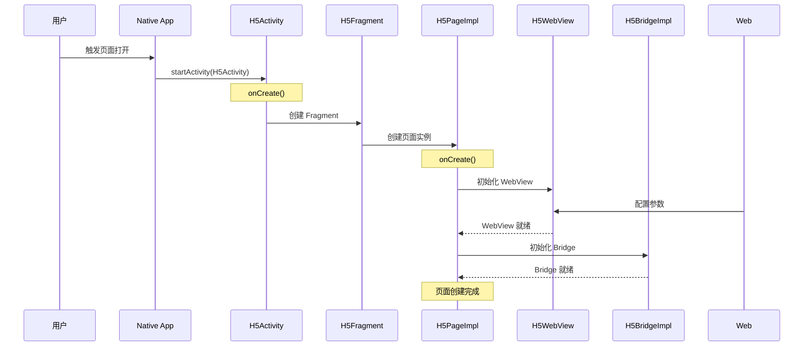
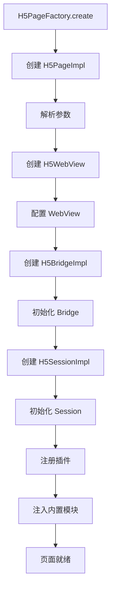
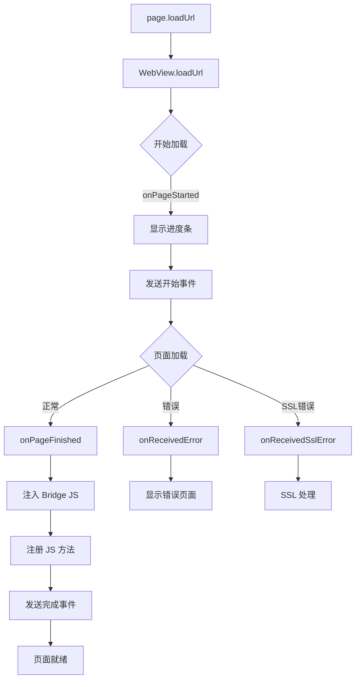
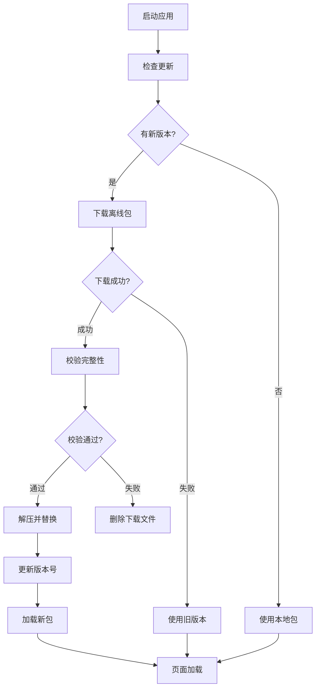
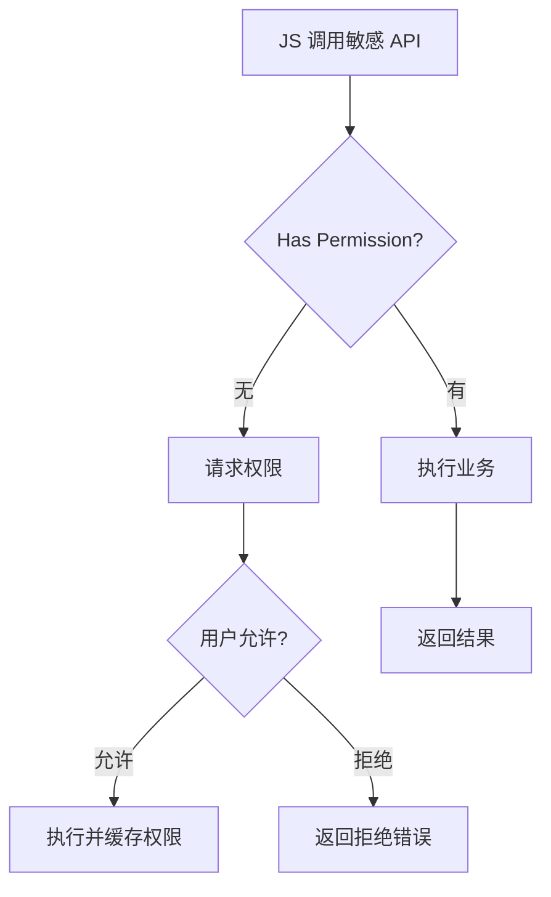
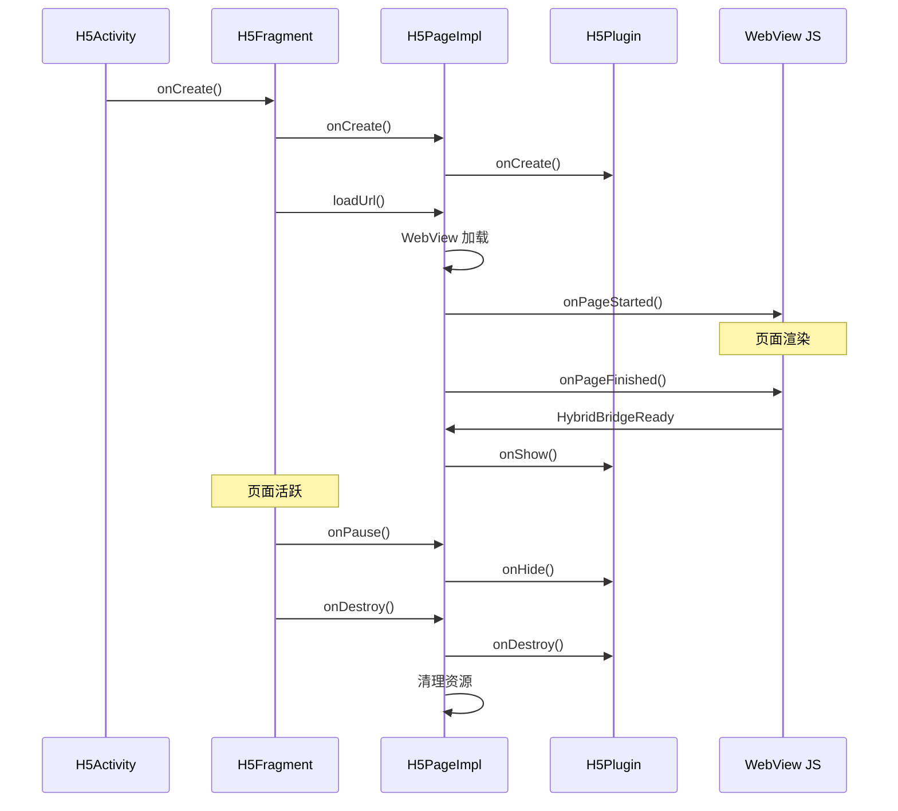

# Coral Android 项目 - 详细业务流程分析

## 🎯 业务流程总览

### 核心业务流程

| 流程 | 复杂度 | 说明 |
|------|--------|------|
| **页面加载** | ⭐⭐⭐ | H5 页面从启动到展示 |
| **JS-Native 通信** | ⭐⭐⭐⭐ | 双向通信机制 |
| **插件调用** | ⭐⭐⭐ | 插件路由与执行 |
| **Session 管理** | ⭐⭐ | 页面栈管理 |
| **离线包更新** | ⭐⭐⭐ | 增量更新机制 |
| **权限管理** | ⭐⭐ | 运行时权限 |

---

## 📄 流程一：H5 页面完整加载流程

### 1.1 启动阶段



**详细代码**:

```java
// 1. 启动 Activity
public void startH5Page(Context context, String url, Bundle params) {
    Intent intent = new Intent(context, H5Activity.class);
    intent.putExtra("url", url);
    intent.putExtra("params", params);
    intent.setFlags(Intent.FLAG_ACTIVITY_NEW_TASK);
    context.startActivity(intent);
}

// 2. Activity onCreate
public class H5Activity extends FragmentActivity {
    
    @Override
    protected void onCreate(Bundle savedInstanceState) {
        super.onCreate(savedInstanceState);
        
        // 获取 URL 和参数
        String url = getIntent().getStringExtra("url");
        Bundle params = getIntent().getBundleExtra("params");
        
        // 预处理 URL
        url = preprocessUrl(url, params);
        
        // 创建 Fragment
        H5Fragment fragment = H5Fragment.newInstance(url, params);
        
        // 添加 Fragment
        getSupportFragmentManager().beginTransaction()
            .replace(android.R.id.content, fragment)
            .commitAllowingStateLoss();
    }
    
    private String preprocessUrl(String url, Bundle params) {
        // 1. 添加默认协议
        if (!url.startsWith("https://") && !url.startsWith("http://")) {
            url = "https://" + url;
        }
        
        // 2. 添加启动参数
        url = addLaunchParams(url, params);
        
        // 3. 添加渠道标识
        url = addChannelParam(url);
        
        return url;
    }
}

// 3. Fragment onCreateView
public class H5Fragment extends Fragment {
    
    @Override
    public View onCreateView(LayoutInflater inflater, ViewGroup container, 
                            Bundle savedInstanceState) {
        // 根布局
        View rootView = inflater.inflate(R.layout.h5_fragment, container, false);
        
        // 标题栏
        titleView = rootView.findViewById(R.id.title_bar);
        
        // WebView 容器
        webViewContainer = rootView.findViewById(R.id.webview_container);
        
        // 加载视图
        loadingView = rootView.findViewById(R.id.loading_view);
        
        // 错误视图
        errorView = rootView.findViewById(R.id.error_view);
        
        return rootView;
    }
    
    @Override
    public void onViewCreated(View view, Bundle savedInstanceState) {
        super.onViewCreated(view, savedInstanceState);
        
        // 获取参数
        String url = getArguments().getString("url");
        Bundle params = getArguments().getBundle("params");
        
        // 创建页面
        H5Page page = H5PageFactory.create(url, params);
        
        // 设置页面回调
        page.setHandler(new H5PageHandler() {
            @Override
            public void onPageStarted() {
                // 显示加载进度
                loadingView.showProgress();
            }
            
            @Override
            public void onPageFinished() {
                // 隐藏加载视图
                loadingView.hide();
            }
            
            @Override
            public void onError(int code, String message) {
                // 显示错误页面
                showErrorPage(code, message);
            }
        });
        
        // 启动加载
        this.page = page;
        page.loadUrl(url);
    }
}
```

---

### 1.2 页面创建阶段



**详细代码**:

```java
public class H5PageFactory {
    
    public static H5Page create(String url, Bundle params) {
        // 1. 解析参数
        PageConfig config = parseParams(params);
        
        // 2. 创建页面实例
        H5PageImpl page = new H5PageImpl();
        
        // 3. 初始化 WebView
        H5WebView webView = createWebView(config);
        page.setWebView(webView);
        
        // 4. 初始化 Bridge
        H5BridgeImpl bridge = createBridge(webView, page);
        page.setBridge(bridge);
        
        // 5. 初始化 Session
        H5SessionImpl session = createSession(page, config);
        page.setSession(session);
        
        // 6. 初始化插件
        List<H5Plugin> plugins = createPlugins(page);
        page.setPlugins(plugins);
        
        // 7. 返回页面
        return page;
    }
    
    private static H5WebView createWebView(PageConfig config) {
        // 获取 Activity (如果存在)
        Activity activity = H5ActivityManager.getTopActivity();
        
        // 创建 WebView
        H5WebView webView = new H5WebView(activity, null, config.toBundle());
        
        // 配置 WebView
        webView.configure(new WebViewConfig() {
            @Override
            public void configure(WebSettings settings) {
                settings.setJavaScriptEnabled(true);
                settings.setDomStorageEnabled(true);
                settings.setDatabaseEnabled(true);
                settings.setAppCacheEnabled(true);
                settings.setCacheMode(WebSettings.LOAD_DEFAULT);
            }
        });
        
        // 设置监听器
        webView.setWebViewClient(new H5WebViewClient() {
            @Override
            public void onPageStarted(WebView view, String url, Bitmap favicon) {
                // 通知页面开始加载
            }
            
            @Override
            public void onPageFinished(WebView view, String url) {
                // 通知页面加载完成
            }
        });
        
        return webView;
    }
    
    private static H5BridgeImpl createBridge(H5WebView webView, H5Page page) {
        // 创建 Bridge 实例
        H5BridgeImpl bridge = new H5BridgeImpl(webView, page);
        
        // 注册内置方法
        registerBuiltinMethods(bridge);
        
        // 注入 Bridge JS
        bridge.injectJavaScript();
        
        return bridge;
    }
    
    private static List<H5Plugin> createPlugins(H5Page page) {
        List<H5Plugin> plugins = new ArrayList<>();
        
        // 1. 页面插件 (必需)
        plugins.add(new H5PagePlugin(page));
        
        // 2. UI 插件 (必需)
        plugins.add(new H5UIPlugin(page));
        
        // 3. 导航插件 (必需)
        plugins.add(new H5NavigatorPlugin(page));
        
        // 4. 存储插件 (必需)
        plugins.add(new H5StoragePlugin(page));
        
        // 5. 根据配置添加可选插件
        if (page.getParams().getBoolean("enableLocation", false)) {
            plugins.add(new H5LocationPlugin(page));
        }
        
        if (page.getParams().getBoolean("enableShare", false)) {
            plugins.add(new H5SharePlugin(page));
        }
        
        if (page.getParams().getBoolean("enablePayment", false)) {
            plugins.add(new H5PaymentPlugin(page));
        }
        
        return plugins;
    }
}
```

---

### 1.3 页面加载阶段



---

## 🌉 流程二：JS 调用 Native 详细流程

### 2.1 JS 层调用

```javascript
// HybridAPI.js

// 调用 Native
HybridAPI.callNative = function(method, params, callback) {
    // 1. 生成回调 ID
    var callbackId = this._generateCallbackId();
    
    // 2. 存入回调 Map
    window._hybridCallbacks[callbackId] = {
        success: callback.success,
        fail: callback.fail,
        complete: callback.complete
    };
    
    // 3. 构建请求参数
    var request = {
        method: method,
        params: params || {},
        callbackId: callbackId,
        timestamp: Date.now()
    };
    
    // 4. 调用 Native (通过 prompt)
    var result = prompt(JSON.stringify(request));
    
    // 5. 处理同步返回
    if (result) {
        try {
            var response = JSON.parse(result);
            if (response.code === 0) {
                // 成功
                callback.success && callback.success(response.data);
            } else {
                // 失败
                callback.fail && callback.fail(response.message);
            }
        } catch (e) {
            callback.fail && callback.fail("解析响应失败");
        }
    }
};

// 获取位置
HybridAPI.getLocation = function(callback) {
    this.callNative('location_getLocation', {}, {
        success: function(res) {
            callback.success && callback.success(res);
        },
        fail: function(err) {
            callback.fail && callback.fail(err);
        }
    });
};

// 分享
HybridAPI.share = function(params, callback) {
    this.callNative('share_share', params, callback);
};

// 设置标题
HybridAPI.setTitle = function(params, callback) {
    this.callNative('ui_setTitle', params, callback);
};
```

### 2.2 Native 层接收

```java
public class H5BridgeImpl implements H5Bridge {
    
    @Override
    public void callNative(String method, JSONObject params, H5BridgeContext context) {
        long startTime = System.currentTimeMillis();
        
        try {
            // 1. 方法名校验
            if (!isMethodAllowed(method)) {
                Log.w(TAG, "方法未授权: " + method);
                context.send(createError("METHOD_NOT_ALLOWED", "方法未授权"));
                return;
            }
            
            // 2. 参数校验
            if (!validateParams(params, method)) {
                Log.w(TAG, "参数错误: " + method);
                context.send(createError("INVALID_PARAMS", "参数错误"));
                return;
            }
            
            // 3. 敏感方法权限检查
            if (isSensitiveMethod(method)) {
                PermissionResult perm = checkPermission(method, params);
                if (!perm.granted) {
                    context.send(createError("NO_PERMISSION", perm.message));
                    return;
                }
            }
            
            // 4. 获取 Handler
            H5BridgeHandler handler = getHandler(method);
            
            if (handler != null) {
                // 5a. 直接调用 Handler
                handler.handle(params, context);
            } else {
                // 5b. 路由到 Plugin
                boolean handled = routeToPlugin(method, params, context);
                
                if (!handled) {
                    // 6. 内置方法处理
                    handleBuiltinMethod(method, params, context);
                }
            }
            
            // 7. 记录调用日志
            long costTime = System.currentTimeMillis() - startTime;
            Log.d(TAG, String.format("callNative: %s, cost: %dms", method, costTime));
            
        } catch (Exception e) {
            Log.e(TAG, "callNative error: " + method, e);
            context.send(createError("INTERNAL_ERROR", "系统错误"));
        }
    }
    
    private boolean routeToPlugin(String method, JSONObject params, 
                                  H5BridgeContext context) {
        // 1. 解析方法名获取插件
        String[] parts = method.split('_');
        if (parts.length < 2) {
            return false;
        }
        
        String pluginName = parts[0] + "Plugin";
        String action = method.substring(pluginName.length() + 1);
        
        // 2. 获取 Plugin
        H5Plugin plugin = pluginMap.get(pluginName);
        if (plugin == null) {
            Log.w(TAG, "Plugin not found: " + pluginName);
            return false;
        }
        
        // 3. 调用 Plugin
        return plugin.handle(action, params, context);
    }
}
```

### 2.3 Plugin 处理示例

```java
// 位置插件
public class H5LocationPlugin extends H5Plugin {
    
    private static final String TAG = "H5LocationPlugin";
    
    @Override
    public boolean handle(String action, JSONObject params, H5BridgeContext context) {
        switch (action) {
            case "getLocation":
                return handleGetLocation(params, context);
            case "startLocation":
                return handleStartLocation(params, context);
            case "stopLocation":
                return handleStopLocation(params, context);
            default:
                return false;
        }
    }
    
    private boolean handleGetLocation(JSONObject params, H5BridgeContext context) {
        // 1. 获取参数
        boolean isWifi = params.getBooleanValue("isWifi");
        boolean isCache = params.getBooleanValue("isCache");
        
        // 2. 检查权限
        if (!checkLocationPermission()) {
            context.send(createError("NO_PERMISSION", "缺少位置权限"));
            return true;
        }
        
        // 3. 检查位置开关
        if (!isLocationEnabled()) {
            context.send(createError("LOCATION_DISABLED", "位置服务未开启"));
            return true;
        }
        
        // 4. 获取位置
        Location location = LocationManager.getLastKnownLocation();
        
        if (location != null && !isExpired(location.getTime(), isCache)) {
            // 5. 返回缓存位置
            context.send(createSuccessResult(locationToJSON(location)));
            return true;
        }
        
        // 6. 请求新位置
        LocationManager.requestLocation(new LocationCallback() {
            @Override
            public void onLocationReceived(Location location) {
                JSONObject result = locationToJSON(location);
                context.send(createSuccessResult(result));
            }
            
            @Override
            public void onLocationError(String error) {
                context.send(createError("LOCATION_ERROR", error));
            }
        }, params);
        
        return true;
    }
    
    private JSONObject locationToJSON(Location location) {
        JSONObject json = new JSONObject();
        json.put("latitude", location.getLatitude());
        json.put("longitude", location.getLongitude());
        json.put("accuracy", location.getAccuracy());
        json.put("speed", location.getSpeed());
        json.put("bearing", location.getBearing());
        json.put("timestamp", location.getTime());
        json.put("address", location.getAddress()); // 逆地理编码
        return json;
    }
}

// 分享插件
public class H5SharePlugin extends H5Plugin {
    
    @Override
    public boolean handle(String action, JSONObject params, H5BridgeContext context) {
        switch (action) {
            case "share":
                return handleShare(params, context);
            default:
                return false;
        }
    }
    
    private boolean handleShare(JSONObject params, H5BridgeContext context) {
        // 1. 解析分享参数
        String type = params.getString("type"); // 分享类型
        String title = params.getString("title");
        String content = params.getString("content");
        String url = params.getString("url");
        String imageUrl = params.getString("imageUrl");
        
        // 2. 创建分享信息
        ShareInfo shareInfo = new ShareInfo();
        shareInfo.setType(ShareType.valueOf(type.toUpperCase()));
        shareInfo.setTitle(title);
        shareInfo.setContent(content);
        shareInfo.setUrl(url);
        shareInfo.setImageUrl(imageUrl);
        
        // 3. 调用分享 SDK
        ShareSDK.share(shareInfo, new ShareCallback() {
            @Override
            public void onSuccess() {
                context.send(createSuccessResult("分享成功"));
            }
            
            @Override
            public void onCancel() {
                context.send(createError("USER_CANCEL", "用户取消"));
            }
            
            @Override
            public void onError(String error) {
                context.send(createError("SHARE_ERROR", error));
            }
        });
        
        return true;
    }
}
```

---

## 📱 流程三：Native 调用 JS

```java
public class H5BridgeImpl implements H5Bridge {
    
    // 直接调用 JS 方法
    @Override
    public void callJs(String bridgeId, String method, JSONObject params) {
        String jsCode = buildJsCode(bridgeId, method, params);
        evaluateJavaScript(jsCode);
    }
    
    // 带回调的 JS 调用
    public void callJsWithCallback(String method, JSONObject params, 
                                   H5BridgeCallback callback) {
        // 1. 生成回调 ID
        String callbackId = "cb_" + System.currentTimeMillis() + "_" 
            + (int)(Math.random() * 1000);
        
        // 2. 存入回调 Map
        callBackMap.put(callbackId, callback);
        
        // 3. 构建 JS 代码
        JSONObject request = new JSONObject();
        request.put("method", method);
        request.put("params", params);
        request.put("callbackId", callbackId);
        
        String jsCode = String.format(
            "window.HybridBridge.handleNativeRequest('%s')",
            request.toJSONString()
        );
        
        // 4. 执行 JS
        evaluateJavaScript(jsCode);
    }
    
    // 发送事件到 JS
    public void sendEventToJs(String eventName, JSONObject data) {
        JSONObject event = new JSONObject();
        event.put("event", eventName);
        event.put("data", data);
        event.put("timestamp", System.currentTimeMillis());
        
        String jsCode = String.format(
            "window.HybridBridge.dispatchEvent(%s)",
            event.toJSONString()
        );
        
        evaluateJavaScript(jsCode);
    }
}
```

**JS 端处理**:

```javascript
// HybridAPI.js

// 接收 Native 调用
HybridBridge.handleNativeRequest = function(request) {
    var method = request.method;
    var params = request.params;
    var callbackId = request.callbackId;
    
    // 调用对应的 JS 方法
    if (typeof HybridBridge[method] === 'function') {
        HybridBridge[method](params, function(result) {
            // 回调 Native
            HybridAPI.callbackToNative(callbackId, {code: 0, data: result});
        });
    } else {
        // 方法不存在
        HybridAPI.callbackToNative(callbackId, {code: -1, message: '方法不存在'});
    }
};

// 派发事件
HybridBridge.dispatchEvent = function(event) {
    // 触发 JS 事件
    var handler = HybridBridge._eventHandlers[event.event];
    if (handler) {
        handler(event.data);
    }
};

// 注册事件监听
HybridBridge.on = function(event, handler) {
    if (!HybridBridge._eventHandlers[event]) {
        HybridBridge._eventHandlers[event] = [];
    }
    HybridBridge._eventHandlers[event].push(handler);
};
```

---

## 📦 流程四：离线包更新流程



---

## 🔐 流程五：权限管理



---

## 🎯 关键时序图

### 页面完整生命周期



---

## 📋 常见调用场景

### 场景一：获取用户位置

```
JS: HybridAPI.getLocation({type: 'wgs84'}, callback)
    ↓
Bridge: callNative('location_getLocation', params, context)
    ↓
Plugin: H5LocationPlugin.handleGetLocation()
    ↓
Manager: LocationManager.requestLocation()
    ↓
Native: 获取 GPS/Network 位置
    ↓
Result: {latitude: 39.9, longitude: 116.4, accuracy: 10}
    ↓
JS Callback: callback.success({lat, lng, accuracy})
```

### 场景二：社交分享

```
JS: HybridAPI.share({type: 'wechat', title: '分享标题', url: '...'}, callback)
    ↓
Bridge: callNative('share_share', params, context)
    ↓
Plugin: H5SharePlugin.handleShare()
    ↓
SDK: 唤起微信分享界面
    ↓
Callback: 分享成功/取消/失败
    ↓
JS Callback: callback.success()/fail()
```

### 场景三：设置标题

```
JS: HybridAPI.setTitle({title: '新标题', color: '#FF0000'}, callback)
    ↓
Bridge: callNative('ui_setTitle', params, context)
    ↓
Plugin: H5UIPlugin.handleSetTitle()
    ↓
View: titleView.setTitle('新标题')
    ↓
Result: {code: 0}
    ↓
JS Callback: callback.success()
```

---

*文档生成时间: 2026-02-05*
*包含: 5 个核心业务流程 + 详细代码示例*
