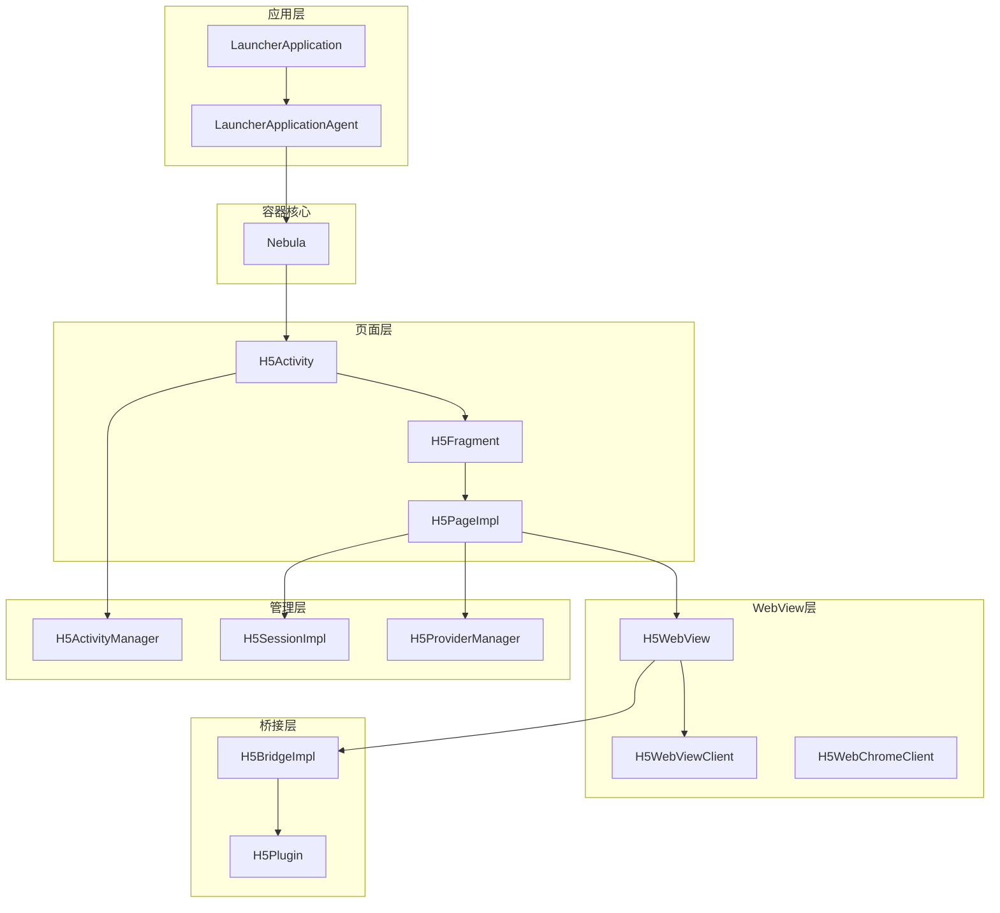
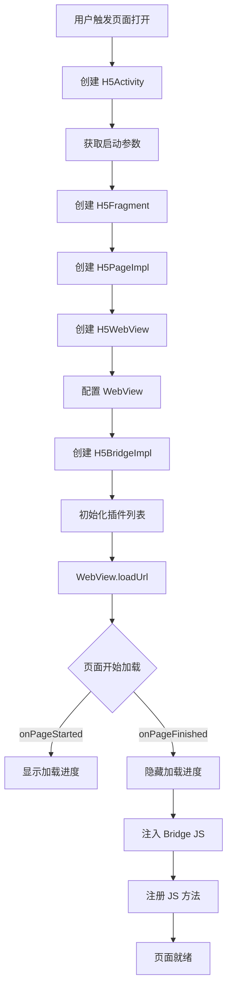
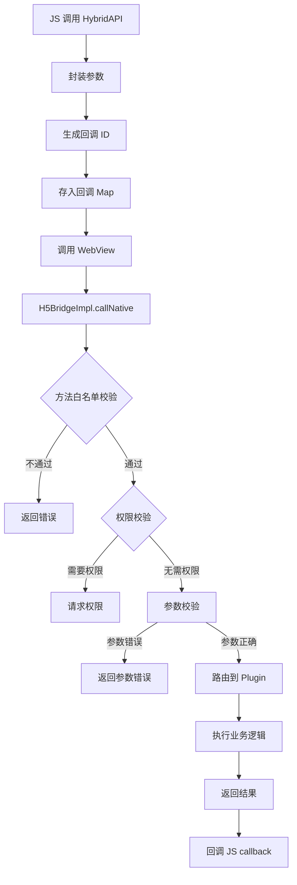
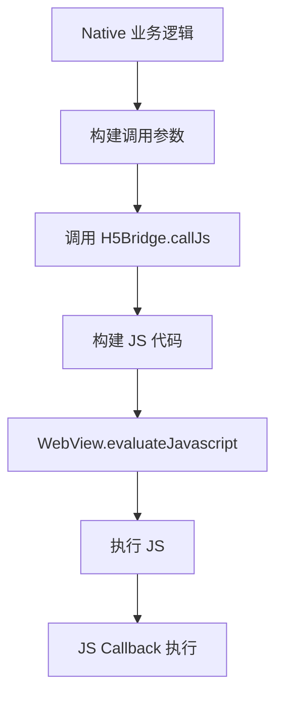

# Coral Android 项目 - 类与业务流程深度分析

## 📊 类统计概览

| 类别 | 数量 | 说明 |
|------|------|------|
| **Manager 类** | 32 个 | 管理器，负责协调和调度 |
| **Service 类** | 25 个 | 服务，封装业务逻辑 |
| **Activity 类** | 15+ 个 | 页面，Android 组件 |
| **Fragment 类** | 10+ 个 | 碎片，页面组件 |
| **Plugin 类** | 12+ 个 | 插件，扩展功能 |
| **Bridge 类** | 8+ 个 | 桥接，JS-Native 通信 |
| **Provider 类** | 20+ 个 | 提供者，依赖注入 |
| **Util 类** | 50+ 个 | 工具类 |
| **Interceptor 类** | 10+ 个 | 拦截器 |
| **Module 类** | 6+ 个 | 功能模块 |
| **Socket 类** | 8+ 个 | 通信套接字 |
| **API 类** | 30+ 个 | 接口定义 |

---

## 🏗️ 核心类详解

### 第一层：应用入口

#### 1. LauncherApplication / LauncherApplicationAgent

**职责**: 应用启动入口，全局上下文管理

```java
// LauncherApplication - 应用启动初始化
public class LauncherApplication extends Application {
    
    @Override
    public void onCreate() {
        super.onCreate();
        
        // 1. 初始化 Nebula 容器
        Nebula.init(this);
        
        // 2. 初始化日志系统
        YLog.init(this);
        
        // 3. 初始化安全模块
        SecurityUtil.init(this);
        
        // 4. 初始化网络配置
        NetworkConfig.init(this);
    }
}

// LauncherApplicationAgent - 单例代理
public class LauncherApplicationAgent {
    private static LauncherApplicationAgent instance;
    private BundleContext bundleContext;
    private MicroApplicationContext microContext;
    
    public static LauncherApplicationAgent getInstance() {
        if (instance == null) {
            instance = new LauncherApplicationAgent();
        }
        return instance;
    }
    
    public BundleContext getBundleContext() { ... }
    public MicroApplicationContext getMicroApplicationContext() { ... }
}
```

**关系**:
```
LauncherApplication → onCreate() → 初始化所有组件
    ↓
LauncherApplicationAgent → 单例持有全局上下文
    ↓
BundleContext → Bundle 生命周期管理
    ↓
MicroApplicationContext → 微应用上下文
```

---

#### 2. Nebula

**职责**: H5 容器核心类，负责容器初始化和全局配置

```java
public class Nebula {
    public static boolean DEBUG = false;
    public static final String TAG = "Nebula";
    
    // 初始化
    public static void init(Context context) {
        // 1. 初始化环境配置
        H5Environment.init(context);
        
        // 2. 初始化 Provider 管理器
        H5ProviderManagerImpl.getInstance();
        
        // 3. 初始化插件管理器
        H5PluginManagerImpl.getInstance();
        
        // 4. 初始化预渲染池
        H5PreRenderPool.getInstance();
    }
    
    // 配置
    public static void config(H5Config config) { ... }
    
    // 状态查询
    public static boolean isInitialized() { ... }
}
```

---

### 第二层：页面管理

#### 3. H5Activity

**职责**: H5 容器页面，承载 WebView 的 Activity

**核心属性**:
```java
public class H5Activity extends FragmentActivity {
    private H5FragmentManager h5FragmentManager;    // Fragment 管理
    private BroadcastReceiver broadcastReceiver;     // 广播接收
    private Bundle intentExtras;                    // 传递参数
    private H5ParamHolder.PageParamListener pageParamListener;
    
    // 页面生命周期
    @Override
    protected void onCreate(Bundle savedInstanceState) {
        super.onCreate(savedInstanceState);
        
        // 1. 获取启动参数
        Bundle extras = getIntent().getExtras();
        
        // 2. 创建 H5Fragment
        H5Fragment fragment = H5FragmentManager.createFragment(extras);
        
        // 3. 替换布局
        setContentView(fragment.getView());
        
        // 4. 启动页面加载
        fragment.startLoad();
    }
}
```

---

#### 4. H5Fragment

**职责**: 承载 H5 页面的 Fragment，管理页面组件

```java
public class H5Fragment extends Fragment {
    private H5Page h5Page;              // 页面实例
    private H5WebView webView;          // WebView 封装
    private H5TitleView titleView;      // 标题栏
    private H5LoadingView loadingView;   // 加载视图
    
    @Override
    public View onCreateView(LayoutInflater inflater, 
                            ViewGroup container, 
                            Bundle savedInstanceState) {
        // 创建页面布局
        View rootView = inflater.inflate(R.layout.h5_fragment_layout, container, false);
        
        // 初始化标题栏
        titleView = rootView.findViewById(R.id.title_bar);
        
        // 初始化 WebView
        webView = rootView.findViewById(R.id.webview);
        
        // 初始化加载视图
        loadingView = rootView.findViewById(R.id.loading_view);
        
        return rootView;
    }
    
    public void startLoad() {
        // 1. 显示加载视图
        loadingView.show();
        
        // 2. 创建页面
        h5Page = H5PageFactory.create(url, params);
        
        // 3. 加载 URL
        h5Page.loadUrl(url);
    }
}
```

---

#### 5. H5Page (接口) / H5PageImpl (实现)

**职责**: H5 页面核心抽象，封装 WebView 和业务逻辑

```java
public interface H5Page extends H5CoreNode {
    // 页面操作
    void loadUrl(String url);
    void reload();
    void goBack();
    void goForward();
    
    // 获取组件
    WebView getWebView();
    H5Bridge getBridge();
    H5Session getSession();
    H5Context getContext();
    
    // 页面信息
    String getUrl();
    String getTitle();
    Bundle getParams();
}

public class H5PageImpl implements H5Page {
    private H5WebView webView;           // WebView 封装
    private H5BridgeImpl bridge;         // JS 桥接
    private H5SessionImpl session;       // Session 管理
    private H5Context context;           // 页面上下文
    private Bundle params;               // 启动参数
    private List<H5Plugin> plugins;     // 插件列表
    
    @Override
    public void loadUrl(String url) {
        // 1. URL 校验
        if (!SecurityUtil.checkUrl(url)) {
            showError("非法 URL");
            return;
        }
        
        // 2. 参数预处理
        url = preprocessUrl(url);
        
        // 3. 设置 Cookie
        CookieManager.setCookie(url);
        
        // 4. 加载页面
        webView.loadUrl(url);
        
        // 5. 注入 Bridge JS
        bridge.injectJavaScript();
    }
}
```

---

### 第三层：WebView 封装

#### 6. H5WebView

**职责**: WebView 封装类，统一管理不同 WebView 实现

```java
public class H5WebView implements H5PullableView, APWebView {
    private APWebView webview;          // 实际 WebView (可能是 UC 或系统 WebView)
    private Bundle recvBundle;           // 启动参数
    private H5OverScrollListener h5OverScrollListener;
    private int webViewIndex = 0;
    private String appId;
    
    public H5WebView(Activity activity, H5Page h5page, Bundle bundle) {
        // 1. 选择 WebView 类型 (UC 或 系统)
        String bizType = H5Utils.getString(bundle, "bizType");
        
        // 2. 通过工厂创建 WebView
        this.webview = H5WebViewFactory.instance()
            .createWebView(activity, bizType, activity, h5page.getParams());
        
        // 3. 配置 WebView
        configureWebView();
    }
    
    private void configureWebView() {
        // 启用 JavaScript
        webview.getSettings().setJavaScriptEnabled(true);
        
        // 启用 DOM 存储
        webview.getSettings().setDomStorageEnabled(true);
        
        // 设置 UserAgent
        String userAgent = buildUserAgent();
        webview.getSettings().setUserAgentString(userAgent);
    }
    
    @Override
    public void loadUrl(String url) {
        // URL 白名单校验
        if (!UrlWhitelist.check(url)) {
            Log.w(TAG, "URL not in whitelist: " + url);
            return;
        }
        
        this.url = url;
        webview.loadUrl(url);
    }
}
```

**WebView 类型选择**:
```java
public enum WebViewType {
    SYSTEM,    // 系统 WebView
    UC,        // UC WebView (性能更好)
    XWEB       // XWeb (腾讯)
}
```

---

#### 7. H5WebViewClient

**职责**: WebView 页面加载回调处理

```java
public class H5WebViewClient extends APWebViewClient {
    
    @Override
    public void onPageStarted(WebView view, String url, Bitmap favicon) {
        // 1. 显示加载进度
        loadingView.showProgress();
        
        // 2. 通知 Bridge 开始加载
        bridge.onPageStarted(url);
        
        // 3. 发送页面开始事件
        EventBus.post(PageEvent.started(url));
    }
    
    @Override
    public void onPageFinished(WebView view, String url) {
        // 1. 隐藏加载进度
        loadingView.hide();
        
        // 2. 注入 Bridge JS
        bridge.injectJavaScript();
        
        // 3. 通知 Bridge 加载完成
        bridge.onPageFinished(url);
        
        // 4. 执行页面完成回调
        onPageLoadCompleted(url);
    }
    
    @Override
    public boolean shouldOverrideUrlLoading(WebView view, WebResourceRequest request) {
        // 处理特殊 Scheme
        String scheme = request.getUrl().getScheme();
        if (isSpecialScheme(scheme)) {
            return handleSpecialScheme(request.getUrl());
        }
        
        return false;
    }
}
```

---

### 第四层：JS Bridge 通信

#### 8. H5Bridge (接口) / H5BridgeImpl (实现)

**职责**: JS 和 Native 之间的桥接，负责双向通信

```java
public interface H5Bridge {
    // 注册 JS 方法
    void register(String methodName, H5BridgeHandler handler);
    
    // 调用 Native
    void callNative(String method, JSONObject params, H5BridgeContext context);
    
    // 调用 JS
    void callJs(String bridgeId, String method, JSONObject params);
    
    // 注入 JS
    void injectJavaScript();
}

public class H5BridgeImpl implements H5Bridge {
    private H5WebView webview;
    private Map<String, H5CallBack> callBackMap;
    private Map<String, Long> valMap;
    private H5Page h5Page;
    
    @Override
    public void callNative(String method, JSONObject params, 
                          H5BridgeContext context) {
        // 1. 方法名校验
        if (!isMethodAllowed(method)) {
            context.send(createErrorResult("方法未授权"));
            return;
        }
        
        // 2. 参数校验
        if (!validateParams(params, method)) {
            context.send(createErrorResult("参数错误"));
            return;
        }
        
        // 3. 权限校验 (敏感方法需要权限)
        if (isSensitiveMethod(method)) {
            if (!checkPermission(method)) {
                context.send(createErrorResult("缺少权限"));
                return;
            }
        }
        
        // 4. 路由到 Plugin 或 Handler
        H5BridgeHandler handler = getHandler(method);
        if (handler != null) {
            handler.handle(params, context);
        } else {
            boolean handled = routeToPlugin(method, params, context);
            if (!handled) {
                context.send(createErrorResult("方法未实现"));
            }
        }
    }
    
    @Override
    public void callJs(String bridgeId, String method, JSONObject params) {
        String jsCode = String.format(
            "window.HybridBridge.callback('%s', '%s', %s)",
            bridgeId, method, params.toJSONString()
        );
        evaluateJavaScript(jsCode);
    }
}
```

**JS Bridge 通信流程**:
```
JS 调用 Native:
JS: HybridAPI.callNative('getLocation', {}, callback)
    ↓
WebView.evaluateJavaScript()
    ↓
H5BridgeImpl.callNative()
    ↓
权限校验 + 参数校验
    ↓
路由到 Plugin 或 Handler
    ↓
执行业务逻辑
    ↓
通过 callback 返回结果
```

---

#### 9. H5Plugin (接口) / 各 Plugin 实现

**职责**: 功能插件，扩展 H5 页面的 Native 能力

**内置插件列表**:

| 插件名 | 功能 |
|--------|------|
| **H5PagePlugin** | 页面生命周期、标题栏 |
| **H5UIPlugin** | 弹窗、Toast、进度条 |
| **H5NavigatorPlugin** | 页面跳转、前进、后退 |
| **H5StoragePlugin** | LocalStorage、Cookie |
| **H5LocationPlugin** | 获取地理位置 |
| **H5SharePlugin** | 社交分享 |
| **H5NetworkPlugin** | 网络状态、HTTP 请求 |
| **H5ImagePlugin** | 选择图片、拍照、预览 |
| **H5PaymentPlugin** | 发起支付 |
| **H5ScannerPlugin** | 二维码扫描 |
| **H5DevicePlugin** | 设备信息、传感器 |
| **H5ContactPlugin** | 选择联系人 |

---

### 第五层：Provider 依赖注入

#### 10. H5ProviderManager / H5ProviderManagerImpl

**职责**: Provider 管理器，负责注册、获取 Provider

**内置 Provider**:

| Provider | 功能 |
|----------|------|
| **H5ConfigProvider** | 配置管理 |
| **H5LogProvider** | 日志记录 |
| **H5DialogProvider** | 弹窗管理 |
| **H5LoadingProvider** | 加载视图 |
| **H5AutoLoginProvider** | 自动登录 |
| **H5UrlDownloadProvider** | 文件下载 |
| **H5EmbededViewProvider** | Native 视图嵌入 |
| **H5LottieViewProvider** | 动画播放 |

---

### 第六层：Session 管理

#### 11. H5Session (接口) / H5SessionImpl (实现)

**职责**: Session 管理，管理页面栈和会话状态

```java
public interface H5Session extends H5CoreNode {
    String getId();
    void setId(String id);
    
    // 页面管理
    boolean addPage(H5Page page);
    boolean removePage(H5Page page);
    H5Page getTopPage();
    Stack<H5Page> getPages();
    
    // 场景
    H5Scenario getScenario();
    void setScenario(H5Scenario scenario);
    
    // 生命周期
    boolean exitSession();
}
```

---

### 第七层：Manager 协调器

#### 12. H5ActivityManager

**职责**: Activity 栈管理，全局页面管理

```java
public class H5ActivityManager implements Application.ActivityLifecycleCallbacks {
    private static H5ActivityManager instance;
    private Stack<Activity> activityStack;  // Activity 栈
    private Map<String, Long> resumeMap;    // 页面 Resume 时间
    private boolean isActive = false;       // 是否在前台
    
    // 关闭所有页面
    public void finishAllActivities() {
        for (Activity activity : activityStack) {
            activity.finish();
        }
        activityStack.clear();
    }
    
    // 获取顶部 Activity
    public Activity getTopActivity() {
        if (activityStack.isEmpty()) {
            return null;
        }
        return activityStack.peek();
    }
}
```

---

## 🔗 类关系图

### 核心类关系



---

## 🔄 业务流程

### 流程一：H5 页面加载流程



### 流程二：JS 调用 Native



### 流程三：Native 调用 JS



---

## 📋 核心类索引

### 基础层 (Foundation)

| 类名 | 路径 | 职责 |
|------|------|------|
| **LauncherApplication** | quinox.app.LauncherApplication | 应用入口 |
| **LauncherApplicationAgent** | quinox.LauncherApplicationAgent | 全局代理 |
| **Nebula** | nebulacore.Nebula | 容器核心 |
| **H5Environment** | nebulacore.env.H5Environment | 环境配置 |

### 页面层 (Page)

| 类名 | 路径 | 职责 |
|------|------|------|
| **H5Activity** | nebulacore.ui.H5Activity | 容器页面 |
| **H5Fragment** | nebulacore.ui.H5Fragment | 页面碎片 |
| **H5PageImpl** | nebulacore.core.H5PageImpl | 页面实现 |
| **H5BaseActivity** | nebula.activity.H5BaseActivity | 基础 Activity |

### WebView 层 (WebView)

| 类名 | 路径 | 职责 |
|------|------|------|
| **H5WebView** | nebulacore.web.H5WebView | WebView 封装 |
| **H5WebViewClient** | nebulacore.web.H5WebViewClient | 页面回调 |
| **H5WebChromeClient** | nebulacore.web.H5WebChromeClient | Chrome 回调 |
| **H5WebViewFactory** | nebulacore.web.H5WebViewFactory | WebView 工厂 |

### Bridge 层 (Bridge)

| 类名 | 路径 | 职责 |
|------|------|------|
| **H5BridgeImpl** | nebulacore.bridge.H5BridgeImpl | Bridge 实现 |
| **H5BridgeContext** | h5container.api.H5BridgeContext | Bridge 上下文 |
| **H5CallBack** | h5container.api.H5CallBack | 回调接口 |

### 插件层 (Plugin)

| 类名 | 路径 | 职责 |
|------|------|------|
| **H5PagePlugin** | nebulacore.plugin.H5PagePlugin | 页面插件 |
| **H5UIPlugin** | nebulacore.plugin.H5UIPlugin | UI 插件 |
| **H5NavigatorPlugin** | nebulacore.plugin.H5NavigatorPlugin | 导航插件 |

### Provider 层 (Provider)

| 类名 | 路径 | 职责 |
|------|------|------|
| **H5ProviderManagerImpl** | nebulacore.manager.H5ProviderManagerImpl | Provider 管理 |
| **H5ConfigProvider** | nebula.provider.H5ConfigProvider | 配置提供 |
| **H5LogProvider** | nebula.provider.H5LogProvider | 日志提供 |

### 管理器层 (Manager)

| 类名 | 路径 | 职责 |
|------|------|------|
| **H5ActivityManager** | adapter.h5.manager.H5ActivityManager | Activity 管理 |
| **H5SessionImpl** | nebulacore.core.H5SessionImpl | Session 管理 |
| **PermissionManager** | nebula.manager.PermissionManager | 权限管理 |

---

*文档生成时间: 2026-02-05*
*分析类数量: 100+ 核心类*
