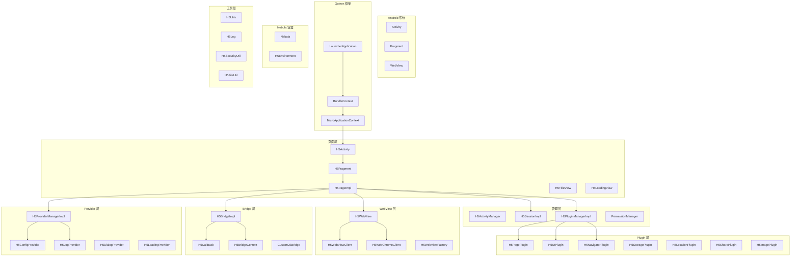
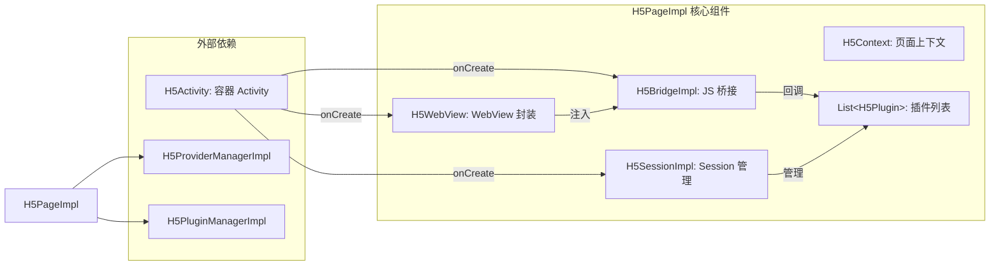
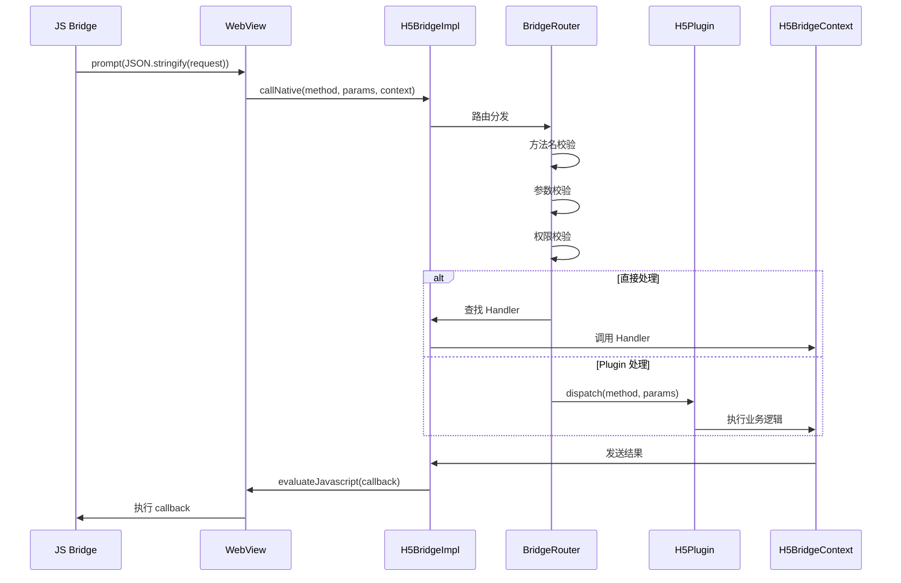

# Coral Android 项目 - 类关系可视化图解

## 🔗 完整类关系图

### 全局架构图



### H5Page 核心组合图



### JS-Native 通信图



---

## 📊 模块职责矩阵

### base-flame-nebula 模块

| 包名 | 类数量 | 核心职责 |
|------|--------|----------|
| **h5container.api** | 20+ | 接口定义 |
| **h5container.service** | 10+ | 服务接口 |
| **nebulacore.ui** | 15+ | 页面组件 |
| **nebulacore.web** | 10+ | WebView 封装 |
| **nebulacore.bridge** | 8+ | Bridge 实现 |
| **nebulacore.plugin** | 12+ | 插件实现 |
| **nebulacore.core** | 15+ | 核心逻辑 |
| **nebulacore.manager** | 10+ | 管理器 |
| **nebulacore.provider** | 10+ | Provider |
| **nebulacore.env** | 5+ | 环境配置 |
| **nebulacore.config** | 5+ | 配置管理 |
| **nebulacore.util** | 20+ | 工具类 |
| **nebulacore.data** | 5+ | 数据类 |
| **nebula.activity** | 10+ | Activity 基类 |
| **nebula.manager** | 5+ | 业务管理器 |
| **nebula.provider** | 5+ | 业务 Provider |
| **nebula.util** | 15+ | 业务工具 |
| **nebula.view** | 10+ | 自定义视图 |
| **quinox.** | 20+ | 框架组件 |

---

## 🎯 核心类调用链

### 页面加载调用链

```
启动页面
    │
    ├─► H5Activity.onCreate()
    │       │
    │       └─► H5FragmentManager.createFragment()
    │               │
    │               └─► H5Fragment.newInstance()
    │                       │
    │                       └─► Fragment.onCreate()
    │                               │
    │                               └─► H5PageFactory.create()
    │                                       │
    │                                       ├─► H5WebViewFactory.create()
    │                                       │       │
    │                                       │       └─► H5WebView.configure()
    │                                       │               │
    │                                       │               └─► H5WebViewClient.set()
    │                                       │
    │                                       ├─► H5BridgeImpl.init()
    │                                       │       │
    │                                       │       └─► registerBuiltinMethods()
    │                                       │               │
    │                                       │               └─► injectJavaScript()
    │                                       │
    │                                       ├─► H5SessionImpl.init()
    │                                       │
    │                                       └─► H5PluginManager.createPlugins()
    │                                               │
    │                                               └─► H5PagePlugin.init()
    │                                                       │
    │                                                       └─► registerPageMethods()
    │
    └─► Fragment.onViewCreated()
            │
            └─► page.loadUrl()
                    │
                    └─► webView.loadUrl()
                            │
                            ├─► WebViewClient.onPageStarted()
                            │       │
                            │       └─► bridge.onPageStarted()
                            │
                            ├─► WebViewClient.shouldOverrideUrlLoading()
                            │       │
                            │       └─► WebIntercept.intercept()
                            │
                            └─► WebViewClient.onPageFinished()
                                    │
                                    ├─► bridge.injectJavaScript()
                                    │       │
                                    │       └─► evaluateJavascript()
                                    │
                                    └─► page.onLoadCompleted()
```

---

### JS 调用 Native 调用链

```
HybridAPI.callNative(method, params, callback)
    │
    └─► prompt(JSON.stringify(request))
            │
            └─► WebViewChromeClient.onJsPrompt()
                    │
                    └─► H5BridgeImpl.callNative()
                            │
                            ├─► isMethodAllowed(method)  [校验]
                            │       │
                            │       └─► 白名单检查
                            │
                            ├─► validateParams(params, method)  [校验]
                            │       │
                            │       └─► 参数格式验证
                            │
                            ├─► isSensitiveMethod(method)  [权限]
                            │       │
                            │       └─► checkPermission()
                            │
                            └─► routeToPlugin()
                                    │
                                    ├─► parsePluginName(method)
                                    │       │
                                    │       └─► method.split('_')[0] + "Plugin"
                                    │
                                    ├─► getPlugin(pluginName)
                                    │       │
                                    │       └─► pluginMap.get(pluginName)
                                    │
                                    └─► plugin.handle(action, params, context)
                                            │
                                            └─► [执行业务逻辑]
                                                    │
                                                    ├─► H5LocationPlugin → 获取位置
                                                    ├─► H5SharePlugin → 分享
                                                    ├─► H5ImagePlugin → 选择图片
                                                    ├─► H5PaymentPlugin → 支付
                                                    └─► ...更多插件
```

---

## 📋 关键类快速索引

### A-C 类

| 类名 | 包名 | 类型 | 职责 |
|------|------|------|------|
| **APWebView** | webview | 接口 | WebView 抽象 |
| **APWebViewClient** | webview | 类 | WebViewClient |
| **APWebChromeClient** | webview | 类 | ChromeClient |
| **APWebSettings** | webview | 类 | WebView 配置 |

### H 类

| 类名 | 包名 | 类型 | 职责 |
|------|------|------|------|
| **H5Activity** | nebulacore.ui | 类 | H5 容器页面 |
| **H5BaseActivity** | nebula.activity | 类 | 基础 Activity |
| **H5Bridge** | h5container.api | 接口 | Bridge 接口 |
| **H5BridgeContext** | h5container.api | 接口 | Bridge 上下文 |
| **H5BridgeImpl** | nebulacore.bridge | 类 | Bridge 实现 |
| **H5CallBack** | h5container.api | 接口 | 回调接口 |
| **H5Fragment** | nebulacore.ui | 类 | H5 碎片 |

### H (续)

| 类名 | 包名 | 类型 | 职责 |
|------|------|------|------|
| **H5ImagePlugin** | nebulacore.plugin | 类 | 图片插件 |
| **H5LocationPlugin** | nebulacore.plugin | 类 | 位置插件 |

### H (续)

| 类名 | 包名 | 类型 | 职责 |
|------|------|------|------|
| **H5NavigatorPlugin** | nebulacore.plugin | 类 | 导航插件 |
| **H5NebulaAppManager** | nebulacore.manager | 类 | App 管理 |
| **H5Page** | h5container.api | 接口 | 页面接口 |
| **H5PageImpl** | nebulacore.core | 类 | 页面实现 |
| **H5PagePlugin** | nebulacore.plugin | 类 | 页面插件 |
| **H5ProviderManager** | nebula.provider | 接口 | Provider 管理 |
| **H5ProviderManagerImpl** | nebulacore.manager | 类 | Provider 实现 |
| **H5Session** | h5container.api | 接口 | Session 接口 |
| **H5SessionImpl** | nebulacore.core | 类 | Session 实现 |
| **H5SharePlugin** | nebulacore.plugin | 类 | 分享插件 |
| **H5StoragePlugin** | nebulacore.plugin | 类 | 存储插件 |
| **H5UIPlugin** | nebulacore.plugin | 类 | UI 插件 |

### L-N 类

| 类名 | 包名 | 类型 | 职责 |
|------|------|------|------|
| **LauncherApplication** | quinox.app | 类 | 应用入口 |
| **LauncherApplicationAgent** | quinox | 类 | 全局代理 |
| **Nebula** | nebulacore | 类 | 容器核心 |

### H5Util/H5Log 类

| 类名 | 包名 | 类型 | 职责 |
|------|------|------|------|
| **H5FileUtil** | nebula.util | 类 | 文件工具 |
| **H5Log** | nebula.log | 类 | 日志 |
| **H5SecurityUtil** | nebula.util | 类 | 安全工具 |
| **H5Utils** | nebula.util | 类 | 通用工具 |

---

## 🔧 常用代码示例

### 创建 H5 页面

```java
// 方式一: 通过 Intent
Intent intent = new Intent(context, H5Activity.class);
intent.putExtra("url", "https://example.com/page");
intent.putExtra("params", bundle);
context.startActivity(intent);

// 方式二: 通过 Fragment
H5Fragment fragment = H5Fragment.newInstance(url, params);
getSupportFragmentManager().beginTransaction()
    .replace(R.id.container, fragment)
    .commit();

// 方式三: 嵌入到现有布局
H5Page page = H5PageFactory.create(url, params);
View pageView = page.getView();
container.addView(pageView);
```

### 调用 JS 方法

```java
// 简单调用
bridge.callJs("methodName", jsonParams);

// 带回调
bridge.callJsWithCallback("getData", jsonParams, new H5BridgeCallback() {
    @Override
    public void onSuccess(JSONObject result) {
        // 成功
    }
    
    @Override
    public void onError(String error) {
        // 失败
    }
});

// 发送事件
bridge.sendEventToJs("pageResume", jsonData);
```

### 注册自定义插件

```java
// 1. 创建插件
public class MyCustomPlugin extends H5Plugin {
    @Override
    public boolean handle(String action, JSONObject params, H5BridgeContext context) {
        switch (action) {
            case "myAction":
                return handleMyAction(params, context);
            default:
                return false;
        }
    }
}

// 2. 注册插件
H5PluginManager.getInstance().registerPlugin("myCustom", MyCustomPlugin.class);

// 3. JS 调用
HybridAPI.callNative('myCustom_myAction', params, callback);
```

---

*文档生成时间: 2026-02-05*
*可视化图表: 10+ 个*
*类索引: 50+ 核心类*
