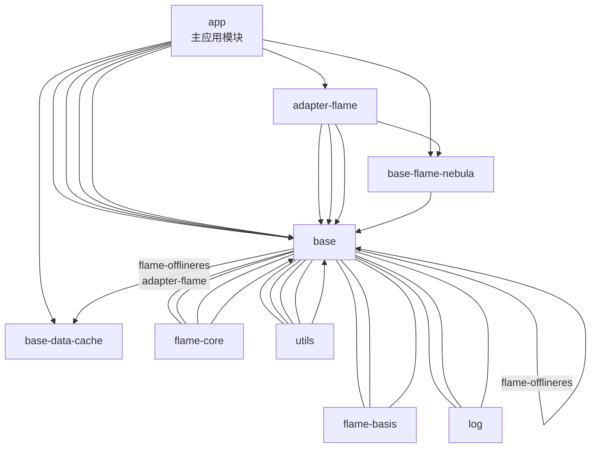

# Coral Android 项目依赖关系图

## 📦 模块列表

| 模块名称 | 包名 | 描述 |
|---------|------|------|
| **app** | com.stht.coral | 主应用模块 |
| **adapter-flame** | com.ynet.finmall.adapter | H5适配层 |
| **base-flame-nebula** | com.ynetpay.mobile | H5容器核心 |
| **base--flame-offlineres** | com.ynet.flame.offlineres | 离线资源管理 |
| **base-data-cache** | com.ynet.finmall.datacache | 数据缓存 |
| **base---flame-core** | com.ynet.flame.core | 核心库 |
| **base----flame-basis** | com.ynet.flame.basis | 基础库 |
| **base---utils** | com.ynet.finmall.base.baseutils | 工具类 |
| **base----log** | com.ynet.finmall.base.log | 日志系统 |

---

## 🔗 模块间依赖关系图



### 依赖层级图

```mermaid
graph LR
    subgraph "应用层"
        app
    end

    subgraph "适配层"
        adapter-flame
    end

    subgraph "容器层"
        base-flame-nebula
        base--flame-offlineres
    end

    subgraph "数据层"
        base-data-cache
        base---flame-core
        base----flame-basis
    end

    subgraph "基础层"
        base---utils
        base----log
    end

    app --> adapter-flame
    app --> base-flame-nebula
    app --> base-data-cache
    app --> base---flame-core
    app --> base----flame-basis
    app --> base---utils
    app --> base----log

    adapter-flame --> base-flame-nebula
    adapter-flame --> base--flame-offlineres
    adapter-flame --> base-data-cache
    adapter-flame --> base---utils
    adapter-flame --> base----log

    base-flame-nebula --> base--flame-offlineres

    base-data-cache --> base---utils

    base---flame-core --> base----flame-basis

    base--flame-offlineres --> base----flame-basis
    base--flame-offlineres --> base---flame-core

    base---utils --> base----log
```

---

## 📚 第三方库依赖分类

### 1️⃣ AndroidX 基础库

| 模块 | 依赖 | 版本 |
|------|------|------|
| **所有模块** | androidx.appcompat:appcompat | 1.6.1 |
| **app** | androidx.core:core-ktx | 1.10.1 |
| **app** | com.google.android.material:material | 1.10.0 |
| **app** | androidx.activity:activity | 1.8.0 |
| **app** | androidx.constraintlayout:constraintlayout | 2.1.4 |
| **base-data-cache** | androidx.localbroadcastmanager | 1.0.0 |

### 2️⃣ Kotlin

| 模块 | 依赖 | 版本 |
|------|------|------|
| **根配置** | org.jetbrains.kotlin.android | 2.0.0 |
| **根配置** | org.jetbrains.kotlin.plugin.compose | 2.0.0 |

### 3️⃣ 网络库

| 模块 | 依赖 | 版本 |
|------|------|------|
| **base----flame-basis** | com.squareup.okhttp3:okhttp | 4.9.2 |

### 4️⃣ JSON 解析

| 模块 | 依赖 | 版本 |
|------|------|------|
| **base-flame-nebula** | com.alibaba:fastjson | 1.2.73 |
| **base----flame-basis** | com.alibaba:fastjson | 1.2.73 |
| **base---utils** | com.alibaba:fastjson | 1.2.73 |
| **base----log** | com.alibaba:fastjson | 1.2.73 |
| **base--flame-offlineres** | com.alibaba:fastjson | 1.2.73 |

### 5️⃣ 异步/RxJava

| 模块 | 依赖 | 版本 |
|------|------|------|
| **base---utils** | io.reactivex.rxjava3:rxjava | 3.0.12 |
| **base---utils** | io.reactivex.rxjava3:rxandroid | 3.0.0 |
| **base----log** | io.reactivex.rxjava3:rxjava | 3.0.12 |
| **base----log** | io.reactivex.rxjava3:rxandroid | 3.0.0 |
| **base-data-cache** | io.reactivex.rxjava3:rxjava | 3.0.12 |
| **base--flame-offlineres** | io.reactivex.rxjava3:rxjava | 3.0.12 |
| **base--flame-offlineres** | io.reactivex.rxjava3:rxandroid | 3.0.0 |

### 6️⃣ 图片加载

| 模块 | 依赖 | 版本 |
|------|------|------|
| **adapter-flame** | com.github.bumptech.glide:glide | 5.0.5 |
| **base---utils** | com.github.bumptech.glide:glide | 5.0.5 |

### 7️⃣ 数据库

| 模块 | 依赖 | 版本 |
|------|------|------|
| **base-data-cache** | org.greenrobot:greendao | 3.0.0 |
| **base----flame-basis** | net.zetetic:android-database-sqlcipher | 3.5.6 |

### 8️⃣ 事件总线

| 模块 | 依赖 | 版本 |
|------|------|------|
| **adapter-flame** | org.simple:androideventbus | 1.0.5.1 |

### 9️⃣ 社交分享

| 模块 | 依赖 | 版本 |
|------|------|------|
| **adapter-flame** | com.tencent.mm.opensdk:wechat-sdk-android-with-mta | 5.4.0 |
| **adapter-flame** | com.umeng.umsdk:common | 9.4.2 |
| **adapter-flame** | com.umeng.umsdk:asms | 1.4.1 |
| **adapter-flame** | com.umeng.umsdk:share-core | 7.1.6 |
| **adapter-flame** | com.umeng.umsdk:share-wx | 7.1.6 |
| **adapter-flame** | com.umeng.umsdk:share-qq | 7.1.6 |
| **adapter-flame** | com.tencent.tauth:qqopensdk | 3.53.0 |

### 🔟 工具类

| 模块 | 依赖 | 版本 |
|------|------|------|
| **adapter-flame** | cn.hutool:hutool-all | 5.8.17 |
| **adapter-flame** | org.apache.commons:commons-lang3 | 3.7 |
| **base---utils** | com.caverock:androidsvg | 1.2.1 |
| **base---utils** | pinyin4android.jar | 1.0 |

### 1️⃣1️⃣ 离线资源

| 模块 | 依赖 | 版本 |
|------|------|------|
| **base--flame-offlineres** | patchzip.jar | - |
| **base--flame-offlineres** | encrypt_zip.jar | - |

### 1️⃣2️⃣ 本地 AAR 库

| 模块 | AAR 文件 | 用途 |
|------|----------|------|
| **app** | aar-device-1.0.00.aar | 设备相关 |
| **app** | aar-encrypt-1.0.00.aar | 加密模块 |
| **app** | aar-persistent-cookie-1.0.00.aar | Cookie持久化 |
| **adapter-flame** | aar-device-1.0.00.aar | 设备相关 |
| **adapter-flame** | aar-encrypt-1.0.00.aar | 加密模块 |
| **base---flame-core** | aar-encrypt-1.0.00.aar | 加密模块 |
| **base---flame-core** | aar-persistent-cookie-1.0.00.aar | Cookie持久化 |

### 1️⃣3️⃣ 其他

| 模块 | 依赖 | 版本 |
|------|------|------|
| **base-flame-nebula** | org.apache.http.legacy.jar | HTTP兼容 |
| **adapter-flame** | com.google.code.findbugs:jsr305 | 3.0.2 |

---

## 📊 各模块详细依赖

### app 模块 (主应用)

```gradle
implementation project(":adapter-flame")
implementation project(":base----flame-basis")
implementation project(":base-data-cache")
implementation project(":base---flame-core")
implementation project(":base-flame-nebula")
implementation project(':base---utils')
implementation project(':base----log')
implementation files("../aar/aar-device-1.0.00.aar")
implementation files("../aar/aar-encrypt-1.0.00.aar")
implementation files("../aar/aar-persistent-cookie-1.0.00.aar")

// AndroidX
implementation libs.androidx.core.ktx
implementation libs.androidx.appcompat
implementation libs.material
implementation libs.androidx.activity
implementation libs.androidx.constraintlayout
```

---

### adapter-flame 模块 (H5适配层)

```gradle
// 模块依赖
implementation project(':base-flame-nebula')
implementation project(':base--flame-offlineres')
implementation project(':base-data-cache')
implementation project(':base---utils')
implementation project(':base----log')

// AAR
compileOnly files("../aar/aar-device-1.0.00.aar")
compileOnly files("../aar/aar-encrypt-1.0.00.aar")

// AndroidX
implementation libs.androidx.appcompat

// 图片
compileOnly "com.github.bumptech.glide:glide:5.0.5"

// 事件
api 'org.simple:androideventbus:1.0.5.1'

// 社交分享
implementation 'com.tencent.mm.opensdk:wechat-sdk-android-with-mta:5.4.0'
implementation 'com.umeng.umsdk:common:9.4.2'
implementation 'com.umeng.umsdk:asms:1.4.1'
implementation 'com.umeng.umsdk:share-core:7.1.6'
implementation 'com.umeng.umsdk:share-wx:7.1.6'
implementation 'com.umeng.umsdk:share-qq:7.1.6'
implementation 'com.tencent.tauth:qqopensdk:3.53.0'

// 工具
implementation 'org.apache.commons:commons-lang3:3.7'
implementation 'cn.hutool:hutool-all:5.8.17'
implementation 'com.google.code.findbugs:jsr305:3.0.2'
```

---

### base-flame-nebula 模块 (H5容器核心)

```gradle
implementation project(':base--flame-offlineres')

// JSON
api 'com.alibaba:fastjson:1.2.73'

// AndroidX
implementation libs.androidx.appcompat

// HTTP兼容
api files('libs/org.apache.http.legacy.jar')
```

---

### base--flame-offlineres 模块 (离线资源)

```gradle
api project(":base----flame-basis")
api project(":base---flame-core")

// RxJava
compileOnly "io.reactivex.rxjava3:rxjava:3.0.12"
compileOnly "io.reactivex.rxjava3:rxandroid:3.0.0"

// ZIP处理
api files('libs/patchzip.jar')
api files('libs/encrypt_zip.jar')

// JSON
compileOnly "com.alibaba:fastjson:1.2.73"

// AndroidX
implementation libs.androidx.appcompat
```

---

### base-data-cache 模块 (数据缓存)

```gradle
implementation project(":base---utils")

// RxJava
implementation "io.reactivex.rxjava3:rxjava:3.0.12"

// 数据库
implementation "org.greenrobot:greendao:3.0.0"

// JSON
compileOnly "com.alibaba:fastjson:1.2.73"

// AndroidX
implementation libs.androidx.core.ktx
```

---

### base---flame-core 模块 (核心库)

```gradle
implementation project(":base----flame-basis")

// AAR
compileOnly files("../aar/aar-encrypt-1.0.00.aar")
compileOnly files("../aar/aar-persistent-cookie-1.0.00.aar")

// AndroidX
implementation libs.androidx.appcompat
```

---

### base----flame-basis 模块 (基础库)

```gradle
// 网络
api 'com.squareup.okhttp3:okhttp:4.9.2'

// JSON
api 'com.alibaba:fastjson:1.2.73'

// 数据库
api 'net.zetetic:android-database-sqlcipher:3.5.6'

// AndroidX
implementation libs.androidx.appcompat
```

---

### base---utils 模块 (工具类)

```gradle
implementation project(":base----log")

// RxJava
api "io.reactivex.rxjava3:rxjava:3.0.12"
api "io.reactivex.rxjava3:rxandroid:3.0.0"

// 图片
api "com.github.bumptech.glide:glide:5.0.5"

// SVG
implementation 'com.caverock:androidsvg:1.2.1'

// JSON
compileOnly 'com.alibaba:fastjson:1.2.73'

// 本地
api files('libs/pinyin4android1.0.jar')
```

---

### base----log 模块 (日志系统)

```gradle
// RxJava
api "io.reactivex.rxjava3:rxjava:3.0.12"
api "io.reactivex.rxjava3:rxandroid:3.0.0"

// JSON
api 'com.alibaba:fastjson:1.2.73'

// AndroidX
api libs.androidx.appcompat
api 'androidx.annotation:annotation:1.2.0'
```

---

## 🎯 依赖总结

### 核心依赖链

```
app (主应用)
  ↓
adapter-flame (适配层)
  ↓
base-flame-nebula (H5容器)
  ↓
base--flame-offlineres (离线资源)
  ↓
base---flame-core (核心) + base----flame-basis (基础)
  ↓
base---utils (工具) + base----log (日志)
```

### 技术栈总结

- **语言**: Kotlin 2.0.0 + Java 1.8
- **UI**: ViewBinding (部分使用)
- **网络**: OkHttp3 + FastJSON
- **异步**: RxJava3 + RxAndroid
- **图片**: Glide 5.0.5
- **数据库**: GreenDAO + SQLCipher
- **H5容器**: 自研 Nebula 框架
- **社交**: 微信SDK + 友盟分享 + QQ SDK
- **工具**: Hutool + Apache Commons

---

## 📁 项目结构

```
coral/
├── app/                    # 主应用模块
├── adapter-flame/          # H5适配层
├── base-flame-nebula/      # H5容器核心
├── base--flame-offlineres/  # 离线资源
├── base-data-cache/        # 数据缓存
├── base---flame-core/      # 核心库
├── base----flame-basis/     # 基础库
├── base---utils/           # 工具类
├── base----log/            # 日志系统
├── encrypt/                # 加密模块 (未启用)
├── aar/                    # 本地AAR库
├── build.gradle            # 根配置
├── settings.gradle         # 模块配置
└── gradle/libs.versions.toml # 版本管理
```

---

*文档生成时间: 2026-02-05*
